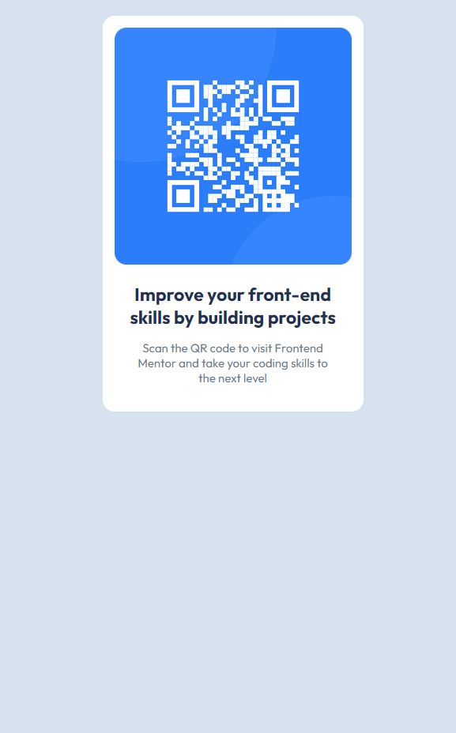

# Frontend Mentor - QR code component solution

This is a solution to the [QR code component challenge on Frontend Mentor](https://www.frontendmentor.io/challenges/qr-code-component-iux_sIO_H). Frontend Mentor challenges help you improve your coding skills by building realistic projects.

## Table of contents

- [Overview](#overview)
  - [Screenshot](#screenshot)
  - [Links](#links)
- [My process](#my-process)
  - [Built with](#built-with)
  - [What I learned](#what-i-learned)
  - [Continued development](#continued-development)
- [Author](#author)

## Overview

### Screenshot



### Links

- Solution URL: [Solution URL](https://github.com/TrEv0rRrRr/qr-component)
- Live Site URL: [Live site URL](https://trev0rrrrr.github.io/qr-component/)

## My process

### Built with

- Semantic HTML5 markup
- CSS custom properties
- Flexbox

### What I learned

```html
<div class="container">
  <div class="img-container">
    
  </div>
  <div class="text-container">
    <p class="p-improve">
      Improve your front-end<br />
      skills by building projects
    </p>
    <p class="p-scanqr">
      Scan the QR code to visit Frontend<br />
      Mentor and take your coding skills to<br />
      the next level
    </p>
  </div>
</div>
```

```css
.container {
  width: 300px;
  background-color: var(--White);
  padding: 15px;
  margin-top: 20px;
  border-radius: 15px;
  text-align: center;
}
```

### Continued development

I'd like to continue learning about front-end and in the future all about back-end.

## Author

- Frontend Mentor - [@TrEv0rRrRr](https://www.frontendmentor.io/profile/TrEv0rRrRr)
